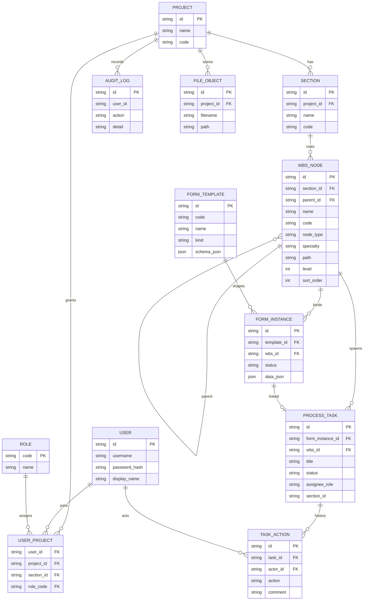

# 领域模型 ER（阶段 0）

## WBS 节点类型

| node_type | 含义 | 层级建议 |
|-----------|------|----------|
| unit | 单位工程 | 1 |
| div | 分部工程 | 2 |
| item | 分项工程 | 3 |
| process | 工序 | 4 |

## 部位 → 默认用表映射（Demo）

| specialty | 默认模板 |
|-----------|----------|
| 路基 | 施表-100 平整度、施表-43 养护 |
| 桥梁 | 施表-43 养护 |
| 隧道 | 施表-43 养护 |
